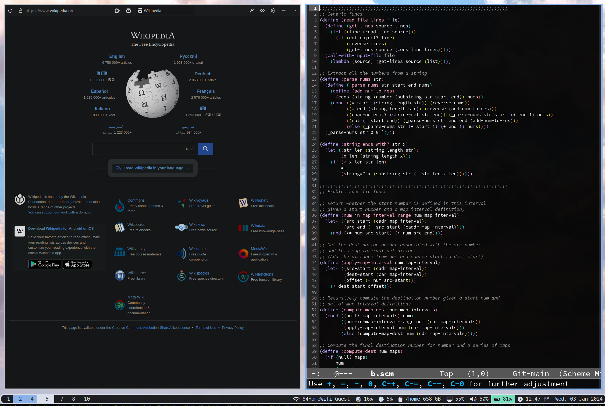
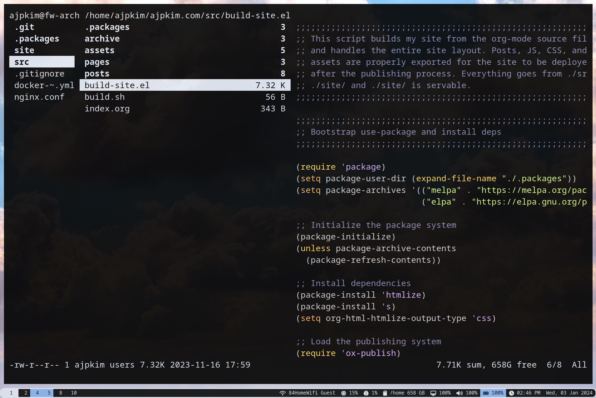
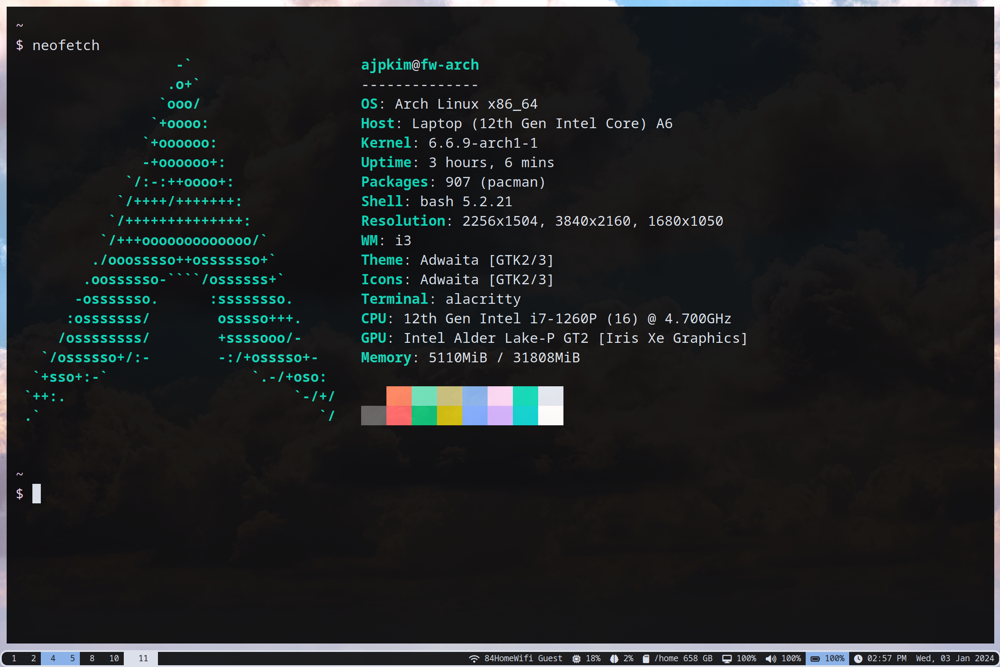

# Alex's dotfiles

This repo contains my config files for everything I use on my personal machines.

Major components:
- OS: arch linux
- Window Manager: i3 (i3lock also)
- Status Bar: polybar
- Editor: emacs
- Terminal: alacritty
- Web Browser: firefox

# Config File Management

I use [GNU stow](https://www.gnu.org/software/stow/) to manage my config files. GNU Stow works by creating symlinks and thus placing config files in the locations that each application specifies for configuration files. Running `stow emacs` when in the repo root directory will create a symlink between the repo directory `emacs/.emacs.d/` and `~/.emacs.d/` on the machine.

# Screenshots

## Firefox & Emacs

## Ranger

## Neofetch
